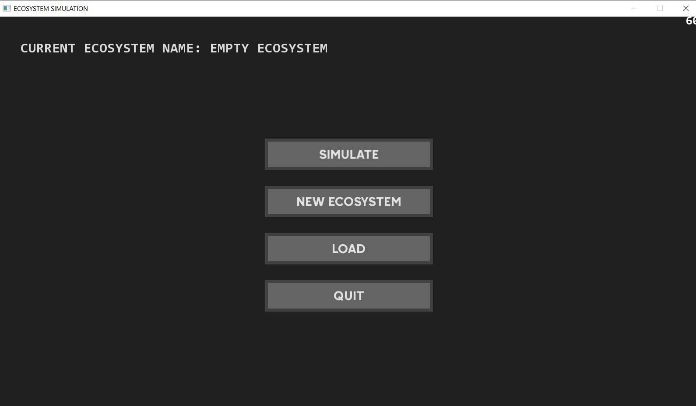
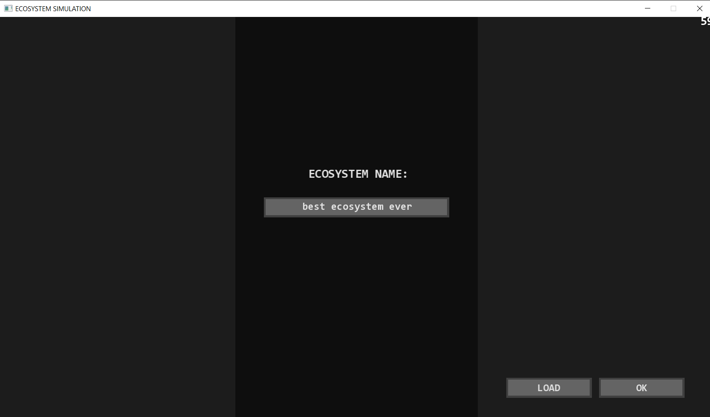
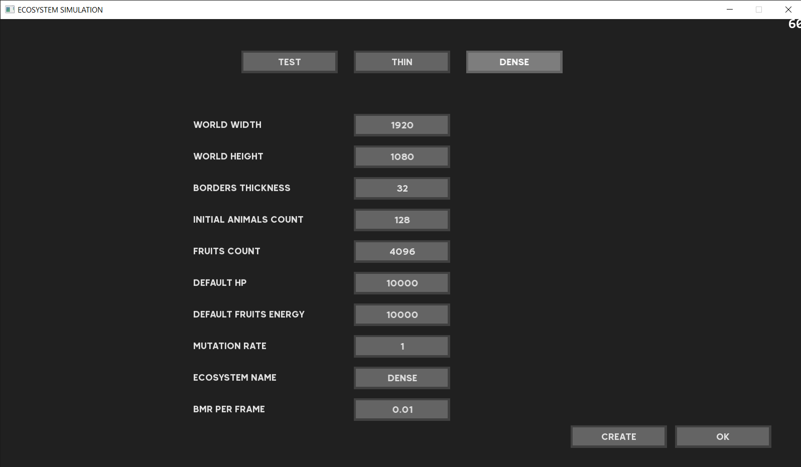
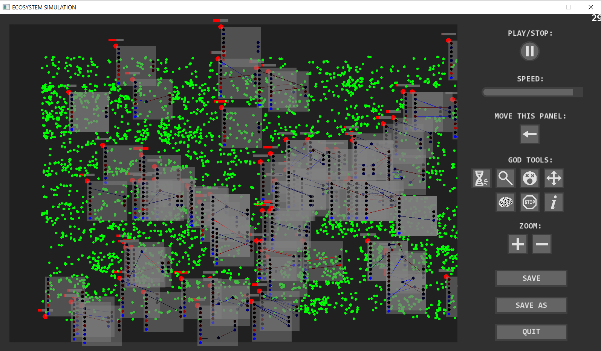
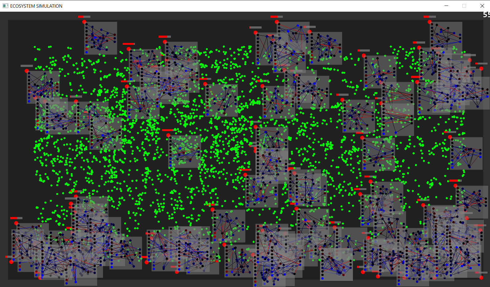
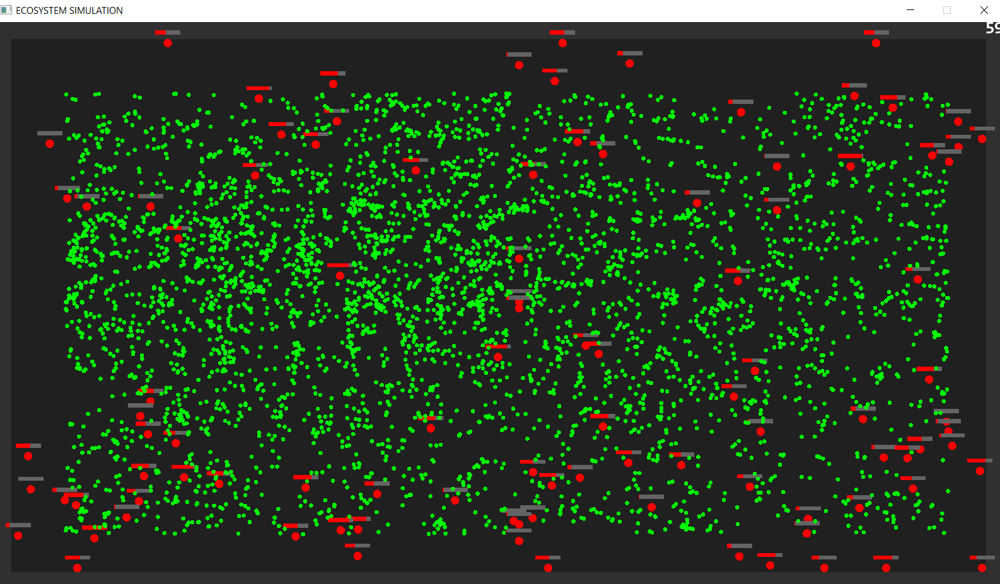

Before I started the project I had thought that it's all about kinematics and I'll finish the project in one day.
After a couple of months I realised that making the program working properly requires implementing quanta of energy like in modern physics (I didn't know about issues with floating-point numbers in programming)

The following sections aren't completed yet, I'm slowly and gradually developing them:

## Dictionary:
HP - hit points; 
	 the greater the number the more energy a specific animal has,
	 the smaller the number the closer an animal is death

BMR - basal metabolic rate;
	  metabolic cost, how many hit points a specific animal loses for sake of surviving,
	  no matter its acceleration and velocity

Blueberry - this how I named the namespace of classes related to neural nets in this project;
            the name can change in the future;
            the nets aren't organised into layers, their construction is simlar to a graph;
            each neuron propagates data one neuron further in every frame of the simulation

## Ecosystem rules:
I'm going to gradually add here the rules of the ecosystem:

* cloning:
  its up to animals if they want to clone 
  (if 3rd output >= 0 then an animal wants to clone, if its < 0 then it don't want to clone);

  but there are some requirements to make cloning possible 
  even if an animal wants to do it:
  - a specific animal can clone itself only once every 5 seconds
  - its HP has to be > 1, because HP is always an integer number; 1 cannot be divided in half;
  	but HP is hardly ever = 1, its almost always a greater number;
  	it can reach values like 10'000 or 1'000'000 or even greater numbers
  	(it depends on initial ecosystem settings)
  - it cannot be close to borders 
  	(it can be at most in 90% of the distance from the center of the arena to the borders)

* mutating:
  Mutations occour after cloning (in the brains of clones) and in every brain every 30 seconds.
  
  At the very beginning of every simulation all brain are empty.
  The only reason animals move is that their output neurons have biases 
  which aren't equal to 0.
  If a brain has 0 or 1 neuron there are only 2 possible mutations - 
  adding a neuron or adding a synapse.
  If a brain is has a bigger number of neurons then every mutation is possible except
  removing a neuron or removing a synapse. 
  The list of possible mutations:
  - adding a synapse
  - adding a neuron
  - changing a synapse weight
  - changing a neuron bias
  - changing a neuron activation function.

## User features:
I'm going to gradually add here the features of the project:

* by holding +/- you are able to zoom in/out the view of the ecosystem camera
* by holding Z key you are able to zoom out the camera so that you can see what is beyond the world
* by moving the mouse cursor to the very left side of the window you are able to open side menu
* by pressing on a specific god tool icon you are able to activate/disactive a god tool
* when brain previewing god tool is turned on you are able to open/hide a specific brain preview
  by clicking on a specific animal with the left mouse button
* you can show/hide all brain previews by pressing B key
* by clicking with the right mouse button on a brain preview you are able to open
  brain preview modifier (or change the modified brain)
* by holding your mouse cursor over a brain element in brain preview modifier 
  while the right button of your mouse is pressed you are able to see more info about that brain element

The entire UI was made by me.

  
  
  
  
  
  
  
  
  
  
  